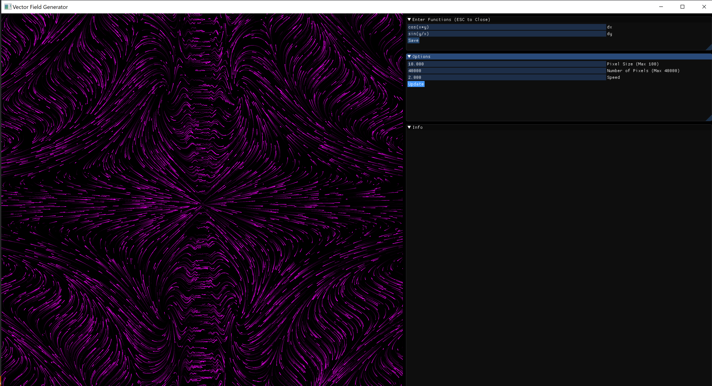

# VectorOpenGL

[1. Overview](#overview)

[2. Issues](#issues)

[3. Dependencies](#dependencies)

## Overview

VectorOpenGL models vector fields, based on an x differential equation, and a y differential equation. With these two inputs, it can create beautiful animated graphs:

## Issues

Currently, the algorythm for calculating the pixel paths is O(n^2), which causes VectorOpenGL to be very slow on my laptop, though it does work perfectly on my desktop. This is top priority for this project. 

Another issue is that when the speed option is increased, it breaks the zoom effect. 

## Dependencies
This project uses [dearImgui](https://github.com/ocornut/imgui) for the user interface, and [exprTk](http://www.partow.net/programming/exprtk/) for equation parsing. 
 
To run project, please link it with GLFW, and GLAD.

[GLAD](https://glad.dav1d.de/)

[GLFW](https://www.glfw.org/)
