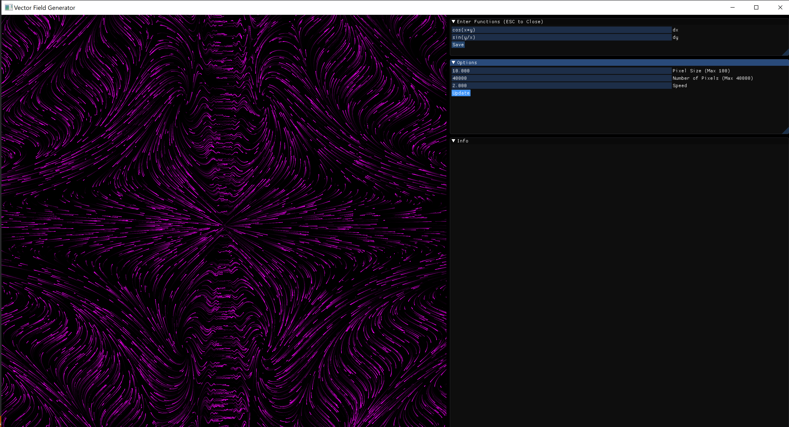

# VectorOpenGL

VectorOpenGL models vector fields, based on an x differential equation, and a y differential equation. With these two inputs, it can create beautiful animated graphs:



## Areas of Improvement

Currently, the algorithm for calculating the pixel paths is O(n^2), which causes VectorOpenGL to be very slow on my laptop, though it does work perfectly on my desktop. This is top priority for this project. 

Another issue is that when the speed option is increased, it breaks the zoom effect. 

## Dependencies
- glfw3
- opengl3

On gentoo:
```bash
emerge -a media-libs/glfw virtual/opengl media-libs/imgui[glfw]
```

## Building
With the above dependencies installed, building should be as simple as:
```bash
$ make clean vog
```

Then run with:
```bash
$ ./vog
```

## Credits
This project uses [dearImgui](https://github.com/ocornut/imgui) for the user interface, [GLAD](https://glad.dav1d.de/) as the OpenGL loader, and [exprTk](http://www.partow.net/programming/exprtk/) for equation parsing. 
